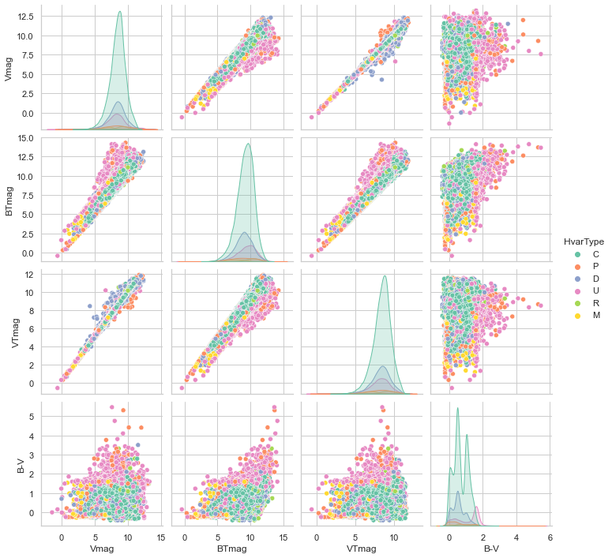

# Machine Learning with the Hipparcos Star Catalog

Exploratory data analysis and stellar classification with pandas, seaborn and sklearn.

Hipparcos Stellar Catalog, collected by the [Hipparcos satellite](https://www.wikiwand.com/en/Hipparcos), from [Kaggle](https://www.kaggle.com/konivat/hipparcos-star-catalog).

This repository includes two jupyter notebooks:

- `HipparcosEDA.ipynb`: exploratory data analysis of the Hipparcos dataset via different visualization routines using pandas and seaborn.

- `HipparcosML.ipynb`: classification of the Hipparcos stars based on their variability and spectral type (see [here](https://www.kaggle.com/konivat/hipparcos-star-catalog/discussion/200255) for more details on the different categories), using random forests, k-NN and PCA in sklearn.

